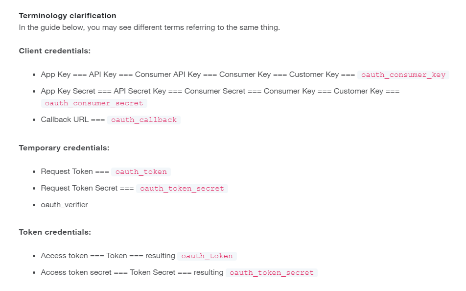

# NLP Covid-19 Vaccine article

## Project Structure

There are 3 files in the project folder:

- `__main__.py`: Main source file
- `Twitter.py`: Handles all Twitter connections and commands
- `credentials.py`: Contains credentials for Twitter API connection
- `requirement.txt`: List of python modules that we need to install

## About this program

We are using the [Tweepy](https://github.com/tweepy/tweepy) module to stream live tweets using specific query or keywords. The Tweepy module returns a detailed json object of a tweet.The program will generate two files.

- `tweet_detailed.txt`: Contains the detailed tweets
- `tweet.txt`: Contains important properties of each tweet
- `tweet.csv`: Same as above, but stored in a csv file

## Prerequisite

It is important that you must have Python 3.6+ installed on your machine. To download Python, click on this [https://www.python.org/downloads/](https://www.python.org/downloads/).

Once installed, we will create a virtual environment to execute the program. We will name the virtual environment `myenv`.

The `venv` module is the preferred way to create and manage virtual environments. `venv` is included in the Python standard library and requires no additional installation. If you are using venv, you may skip this section.

To create a virtual environment, go to your project’s directory and run venv

To create the virtual environment, open the `cmd` or `terminal` in the code directory and type the following command:

On macOS and Linux:

```shell
python3 -m venv env
```

On Windows:

```shell
python -m venv myenv
```

This will create a new folder within the application folder.

To activate our virtual environment, type the following:

On macOs and Linux:

```shell
source env/bin/activate
```

On Windows:

```shell
.\myenv\Scripts\activate
```

You will notice the name of our virtual environment appearing before the user name
`(myenv) C:\Users\r.kanaan`

Now that we have our virtual environment running, we need to install the dependencies for the program. We install them by writing the following command:

On macOs and Linux:

```shell
pip3 install -r requirement.txt
```

On Windows:

```shell
pip install -r requirement.txt
```

**Note**: Be sure you're in the project’s directory folder, otherwise the command will throw an error

## Credentials

In order to use Tweepy, you need to have a Twitter developer account. Below is the Twitter terminology in case of any confusion with the Tweepy docs



## Executing the program

Open the `cmd` or `terminal` on the project directory folder and write the following command:

```shell
python __main__.py
```

Once executed, the files will be created automatically.
